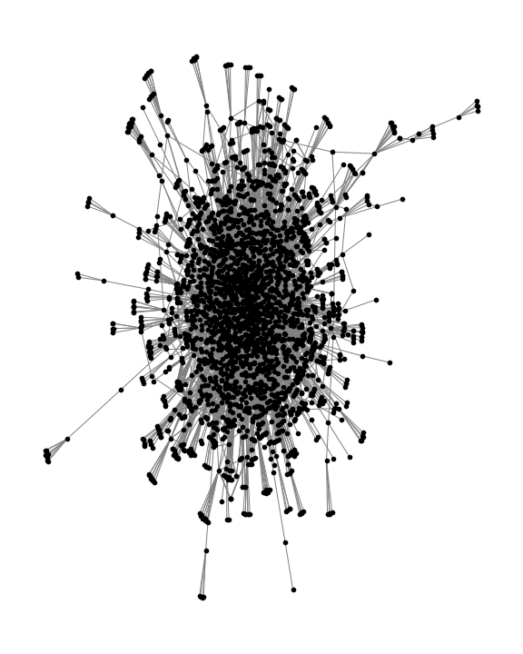

```{r setup, include=FALSE}
#knitr::opts_chunk$set(echo = TRUE)
```

## Results 


In the first stage of my analysis, I analyse characteristics of the larger network of board interlocks in the years 2000, 2010 and 2020 to determine large shifts over time. I created a dataset of board connections from the years 1996-2023 by merging ISS and Boardex Network Associations datasets on Ticker. The resultant dataframe contained a sample of 3054 unique focal firms over 493,977 firm-years from 1996-2022. In comparison, the sample used by Chu and Davis as representative of the S&P1500 contained 2,454 unique focal firms over 151,135 firm-years. 

A single board interlock is created by a director serving on two boards. The two boards are considered "interlocked." A firm's direct ties are the number of firms it shares at least one director with. The resulting firm-year level dataframe contains rows of year-focal firm-connected firm-common director. If a firm shares multiple directors with another firm, those connections were collapsed into a single tie, resulting in a dataframe containing year-focal firm-number of direct ties. I used this dataframe to compare how the number of direct ties for the most highly connected firms have changed over time. 

I ranked the top 25 firms by Degree, Degree Centrality, Eigenvector Centrality and Mean Geodesic for each year 2000, 2010 and 2020. 

The Degree table indicates that the number of direct ties for the most highly connected companies in the network have declined over time: in 2000, Bank of America Corp, the most highly connected firm, had direct interlocks with 48 other companies. In contrast, in 2010, the most highly connected firm in the network, Marimaca, had only 41 direct ties. And in 2020, the most highly connected company, Brookfield, had ever fewer direct ties to only 28 companies. The average degree for companies in the S&P1500 sample was 8.51 in 2000 (for 1843 companies), 7.78 in 2010 (for 2043 companies) and 8.15 in 2020 (for 1826 companies). The averages do not indicate significat movement in the number of direct ties. 


Table 1: Description of Centrality Measures Computed
-----------------------------
Measure | Description
------------- | -------------
Degree | The number of companies the focal company is connected to 
Degree Centrality | A recursive measure to rank the company in the larger network by its degree
Eigenvector Centrality | A recursive measure to rank the company in the larger network by not only its degree but the degree of the companies it is connected to 
```{r degree, echo=FALSE}
#need to make a list of dfs
d1= read.csv("output/2000_firm/d_10.csv")
d2= read.csv("output/2010_firm/d_10.csv")
d3= read.csv("output/2020_firm/d_10.csv")

knitr::kables(
  list(
    # the first kable() to change column names
    knitr::kable(
      d1[, 2:3], col.names = c('Company', 'Degree'), digits = 0, valign = 't'
      ),
    # the second kable() to set the digits option
    knitr::kable(
      d2[, 2:3], col.names = c('Company', 'Degree'), digits = 0, valign = 't'
      ),
     # the third kable() to set the digits option
    knitr::kable(
      d3[, 2:3], col.names = c('Company', 'Degree'), digits = 0, valign = 't'
      )
  ),

   caption = 'Table 2: Top 25 Firms by Degree. 2000 (left), 2010 (center), 2020 (right)'
)
```

The distribution of directors on boards of S&P500 firms by the number of board seats served on shows that the number of directors serving on more than three board seats has declined significantly over time: in 1996, 40.9% of directors held more than 3 board seats (that is, there were 397 directors out of a total of 970 holding seats on more than 3 companies' boards) however, in 2000, this number had declined to 36.6% (940 out of 2567) and in 2020 it was 32.4% (863 out of 2663). It is possible the analysis was affected by the limited data available for S&P500 firms in the year 2000, but given that the sample used was smallest in 2000 yet yielded the highest portion of directors holding >3 board seats, it is logical to assume that the share would only be bigger if a larger sample had been used. This indicates a clear decline in the number of "super-connected" directors who hold numerous board seats. 


In the sample of directors serving on 8 or less boards of S&P1500 firms, there is an evident decline from 2010 to 2020 in the number of directors serving on more than 5 boards. In 2000 461 directors sat on the boards of six or more distinct companies (see fig 2) and 60 sat on the boards of 5. In contrast, in 2010, 581 directors sat on more than 6 boards and only 51 sat on 5. These numbers further declined in 2020, where 509 directors sat on more than 6 boards and 52 sat on 5. While the number of directors serving on fewer board seats (1-5) shows an increase (likely due to the higher number of firms included in the sample in recent years), there was a consistent decline from 2010-2020 in the number of "highly connected" directors serving on 3 or more boards (see fig 3). In 2000, 2010, and 2020 the average number of seats held by directors was 1.35, 1.39 and 1.55 respectively. 


I explored the possibility that this decline was due to age or retirement related attrition by examining the median age of directors in 2000, 2010 and 2020: the median ages for all directors were 73, 73 and 72. For "highly connected" directors (that is, directors serving on more than 5 board seats), the median ages were 74, 76 and 70. Higher median age in 2010 and lower age in 70 implies that it is possible that the decline may be partially due to age related attrition. 

[Fig 2: Distribution of S&P1500 Board Directors by the number of board seats held](dirdist.png)

[Fig 3: Number of directors with more than 5 board seats](dir.png)


To further analyze the change in connectivity at the firm level, I visualized the denseness of the firm level interlock network by visualizing the main component of the network for S&P500 firms in 2000, 2010, and 2020. Due to limited data available from Boardex for years prior to 2010, the sample for 1996 contained only 266 firms. In contrast, the sample for 2010 contained 530 firms (since there are often slightly more than 500 firms listed on the S&P500) and the sample for 2020 contained 503 firms.

The graphs indicate a weak decline over time in the denseness of the firm level board interlock network, with the main component of the 2020 network being more spread out than the main component of the 2010 network. In other words, the 2010 graph demonstrates strong connectivity between a smaller set of firms.


## Show images
 


## Logistic Regression
Chu and Davis (2016) find that odds of gaining a new board seat for highly connected directors have declined over time, indicating a broader decline in the interlock network. Do directors who are already highly connected gain the most new connections? Does this create a self re-inforcing board interlock network? What predicted the odds of a director gaining another board seat? To answer these questions I regressed the odds of gaining a new board seat in the subsequent year for a director against a set of predictors (see table 3). Predictors were chosen based on key demographic characteristics, degree centrality measures, and company information. Chu and Davis (2016) use "social status" as a predictor, measuring social status as whether or not the board director graduated from Harvard, Yale, Princeton or Stanford University. Educational qualification and graduation data was not available via Boardex or ISS and could not be used in my study. similarly, Chu and Davis also use ethnicity as a predictor, but ethnicity data was not available via Boardex. Instead, I use nationality coded as 1 if American, and 0 if Not American. 

I used company information from the largest board the director served on. I used market capitalization and number of employees as predictors. The key predictor used was the "Network Size", defined by Boardex as the total number of overlaps through serving on boards of firms, nonprofits and education. I captured the time varying component of the regression using "Years since 1995" as a predictor, following the methods of Chu and Davis (2016).

I hypothesized that as the years became more recent the coefficients for gender and nationality would increase while the coefficients for company metrics would stay the same. I expected to see an increase in the effect of gender and nationality corresponding to social changes in the past 20 years for more inclusion of women and minority ethnicities in powerful corporate positions and boards. The key goal of the regression was to examine the changes in the coefficients for network size and centrality measures. 
The original sample contained 18,485 unique directors across 1995-2022. The highest number of seats held by any director in the sample in any year was 8. The director with the highest number of board seats was Sam Nunn (consistent with Chu and Davis). After dropping NA values for running the regression, the sample contained 41,705 rows with 8,253 distinct directors. 


```{r, echo=FALSE}
#variance scatterplots plots by year
df = read.csv("output/profile_datv1.csv")


```

```{r, echo=FALSE, eval=FALSE}

library(ggplot2)
gg0 <- ggplot(df,aes(ns,subs_year,colour=Gender))+
stat_sum(alpha=0.5)+facet_wrap(~nat,labeller=labeller(nat = c("Not American", "American"))) + labs(main = 'Gained a Board Seat in the Subsequent Year by Network Size', xlab = 'Network Size (see table 3)' , ylab='Gained another board seat in sbsequent year')

gg0 + geom_smooth(aes(group=1))
```

```{r, echo=FALSE, eval=FALSE}
library(dplyr)
Contraception <- df

Contraception <- Contraception %>% 
        rename("livch"= "nat",
                "urban" = "Gender",
               "age" = "ns" ,
               "use" = "subs_year" )

```

```{r, echo=FALSE, eval=FALSE}
## transform via tidyverse ...
cc <- (Contraception
%>% mutate(
## numeric (0/1) version of 'uses contraception'
use_n=as.numeric(use)-1)
)

cc_agg0 <- (cc %>% 
              group_by(livch,urban,age) 
            %>% summarise(prop=mean(use_n), n=length(use), se=sqrt(prop*(1-prop)/n))
)


#Plot:
ggplot(cc_agg0,aes(age,prop,colour=urban))+
geom_pointrange(aes(ymin=prop-2*se,
ymax=prop+2*se))+
facet_wrap(~livch,labeller=label_both)

```

```{r, echo=FALSE}
m1 <- glm(subs_year ~ Age + mkt_cap + age_sq + age_sc + Gender + emp + ns + nat  + years_since_95, data = df)

m2 <- glm(subs_year ~ age_sc + Gender + ns + nat + years_since_95, data = df)

summary(m1)

summary(m2)

```


```{r, echo=FALSE}

#install.packages("stargazer") 
#library(stargazer)
#stargazer(m1, type="html", out="test.html", out.header=TRUE, title = 'Regression Results')


```


```{r, eval=FALSE, echo=FALSE}
stargazer(m2, type="html",
dep.var.labels=c("Gained Additional Board Seat in Subsequent Year (=1)"),
covariate.labels=c("Age (scaled)","Gender","Network Size",
"Nationality (American =1)","Years since 1995"))
#update.packages(ask = FALSE, checkBuilt = TRUE)
#tinytex::tlmgr_update()
#options(tinytex.verbose = TRUE)

```


